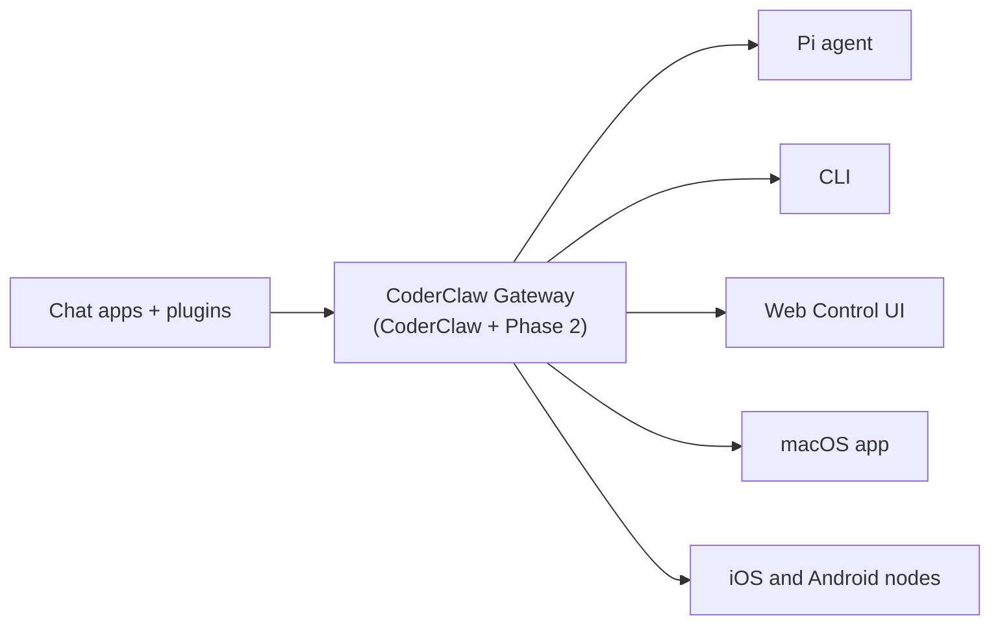

# CoderClaw 🦞

<p align="center">
    
    
</p>

> _"EXFOLIATE! EXFOLIATE!"_ — A space lobster, probably

<p align="center">
  <strong>Self-hosted, open-source AI-powered coding assistant with multi-channel integrations for WhatsApp, Telegram, Discord, iMessage, and more.</strong><br />
  Advanced multi-agent workflows, deep code understanding, and RBAC make it ideal for developers and teams. Get coding help, code reviews, and development assistance from anywhere. Plugins add Mattermost and more platforms.
</p>

<Columns>
  <Card title="Get Started" href="/start/getting-started" icon="rocket">
    Install CoderClaw and bring up the Gateway in minutes.
  </Card>
  <Card title="Run the Wizard" href="/start/wizard" icon="sparkles">
    Guided setup with `coderclaw onboard` and pairing flows.
  </Card>
  <Card title="Open the Control UI" href="/web/control-ui" icon="layout-dashboard">
    Launch the browser dashboard for chat, config, and sessions.
  </Card>
</Columns>

## What is CoderClaw?

CoderClaw is a **distributed AI runtime** built on top of [CoderClaw](https://github.com/SeanHogg/coderClaw)'s self-hosted gateway. It connects your favorite chat apps — WhatsApp, Telegram, Discord, iMessage, and more — to AI coding agents, with added **Phase 2 capabilities** for secure orchestration, distributed task execution, and team collaboration.

**Who is it for?** Developers and teams who want a personal AI assistant with enterprise-ready features like RBAC, audit trails, and CI/CD integration — without giving up control of their data or relying on a hosted service.

**What makes it different from CoderClaw?**

- **Distributed Runtime**: Execute tasks locally or remotely with transport abstraction
- **Enhanced Security**: RBAC, device trust levels, and granular policy enforcement
- **Task Lifecycle Management**: Formal state machine with audit trails and resumability
- **Team Collaboration**: Multi-session isolation and shared agent registries
- **CI/CD Ready**: Designed for automated workflows and team-wide deployments

**What do you need?** Node 22+, an API key (Anthropic recommended), and 5 minutes.

## How it works



The Gateway is the single source of truth for sessions, routing, and channel connections, enhanced with distributed task execution and security controls.

## Key capabilities

<Columns>
  <Card title="Distributed Runtime" icon="network">
    Execute tasks locally or remotely with transport abstraction layer.
  </Card>
  <Card title="Enhanced Security" icon="shield">
    RBAC, device trust levels, and audit logging for enterprise-ready deployments.
  </Card>
  <Card title="Multi-channel gateway" icon="network">
    WhatsApp, Telegram, Discord, and iMessage with a single Gateway process.
  </Card>
  <Card title="Task Lifecycle" icon="clock">
    Formal state machine with persistence, resumability, and audit trails.
  </Card>
  <Card title="Team Collaboration" icon="users">
    Multi-session isolation and shared agent registries for teams.
  </Card>
  <Card title="CI/CD Integration" icon="git-branch">
    Automated workflows with deterministic execution and GitHub Actions support.
  </Card>
</Columns>

## Quick start

<Steps>
  <Step title="Install CoderClaw">
    ```bash
    npm install -g coderclaw@latest
    ```
  </Step>
  <Step title="Onboard and install the service">
    ```bash
    coderclaw onboard --install-daemon
    ```
  </Step>
  <Step title="Pair WhatsApp and start the Gateway">
    ```bash
    coderclaw channels login
    coderclaw gateway --port 18789
    ```
  </Step>
</Steps>

Need the full install and dev setup? See [Quick start](/start/quickstart).

## Dashboard

Open the browser Control UI after the Gateway starts.

- Local default: [http://127.0.0.1:18789/](http://127.0.0.1:18789/)
- Remote access: [Web surfaces](/web) and [Tailscale](/gateway/tailscale)

<p align="center">
  
</p>

## Configuration (optional)

Config lives at `~/.coderclaw/coderclaw.json`.

- If you **do nothing**, CoderClaw uses the bundled Pi binary in RPC mode with per-sender sessions.
- If you want to lock it down, start with `channels.whatsapp.allowFrom` and (for groups) mention rules.
- For Phase 2 features, see [Phase 2 Configuration](/phase2#configuration).

Example:

```json5
{
  channels: {
    whatsapp: {
      allowFrom: ["+15555550123"],
      groups: { "*": { requireMention: true } },
    },
  },
  messages: { groupChat: { mentionPatterns: ["@coderclaw"] } },
}
```

## Start here

<Columns>
  <Card title="Docs hubs" href="/start/hubs" icon="book-open">
    All docs and guides, organized by use case.
  </Card>
  <Card title="Configuration" href="/gateway/configuration" icon="settings">
    Core Gateway settings, tokens, and provider config.
  </Card>
  <Card title="Remote access" href="/gateway/remote" icon="globe">
    SSH and tailnet access patterns.
  </Card>
  <Card title="Channels" href="/channels/telegram" icon="message-square">
    Channel-specific setup for WhatsApp, Telegram, Discord, and more.
  </Card>
  <Card title="Nodes" href="/nodes" icon="smartphone">
    iOS and Android nodes with pairing and Canvas.
  </Card>
  <Card title="Help" href="/help" icon="life-buoy">
    Common fixes and troubleshooting entry point.
  </Card>
</Columns>

## Learn more

<Columns>
  <Card title="Full feature list" href="/concepts/features" icon="list">
    Complete channel, routing, and media capabilities.
  </Card>
  <Card title="Multi-agent routing" href="/concepts/multi-agent" icon="route">
    Workspace isolation and per-agent sessions.
  </Card>
  <Card title="Security" href="/gateway/security" icon="shield">
    Tokens, allowlists, and safety controls.
  </Card>
  <Card title="Troubleshooting" href="/gateway/troubleshooting" icon="wrench">
    Gateway diagnostics and common errors.
  </Card>
  <Card title="About and credits" href="/reference/credits" icon="info">
    Project origins, contributors, and license.
  </Card>
</Columns>
